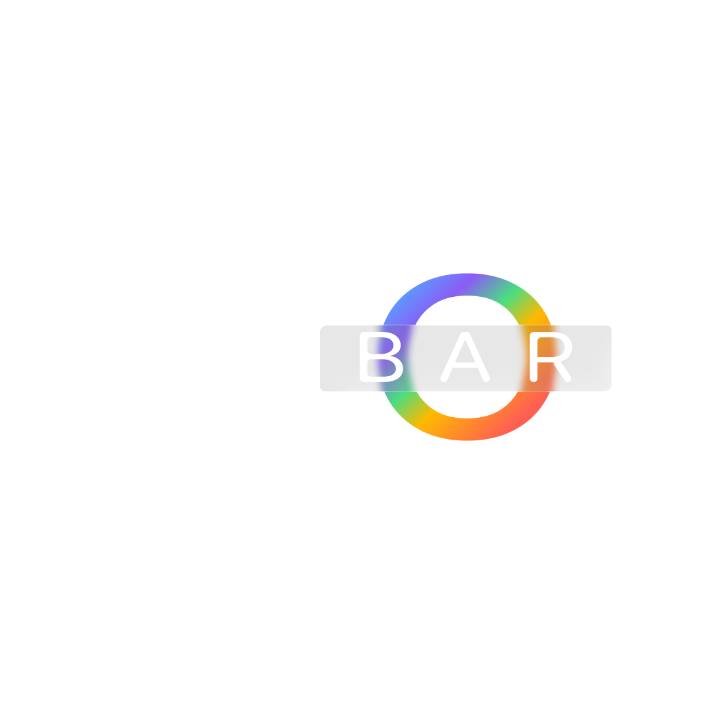
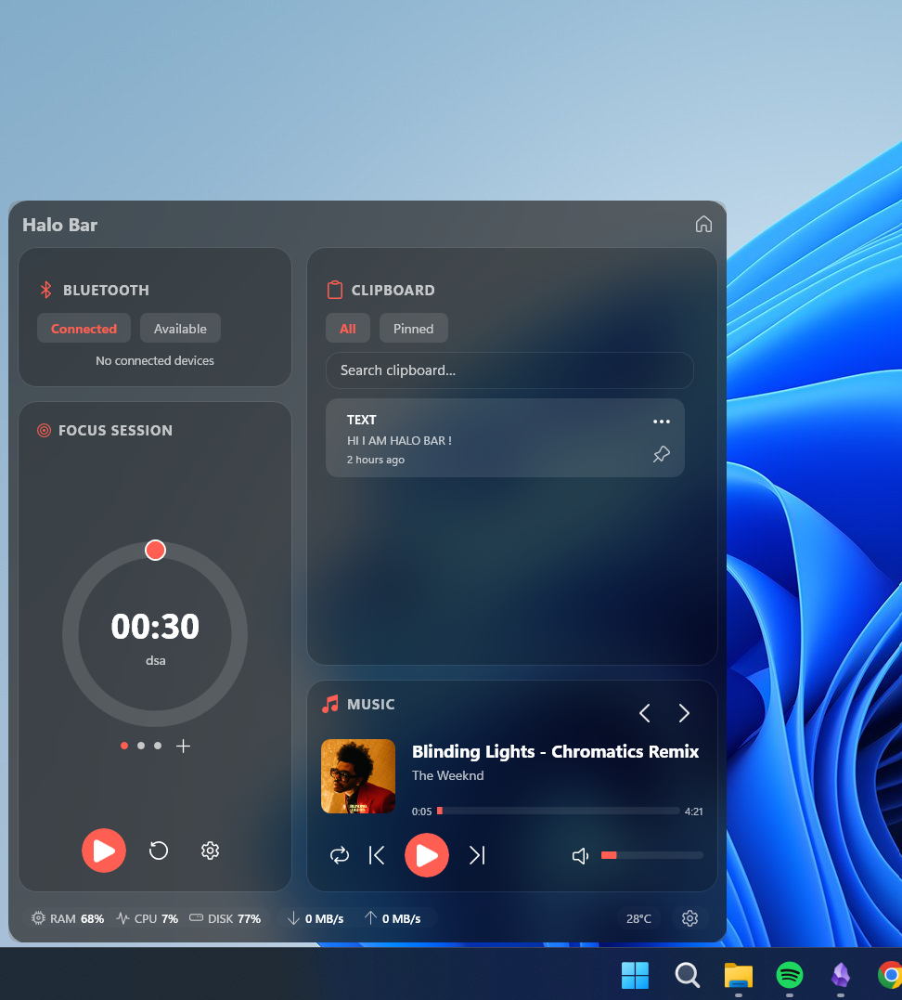
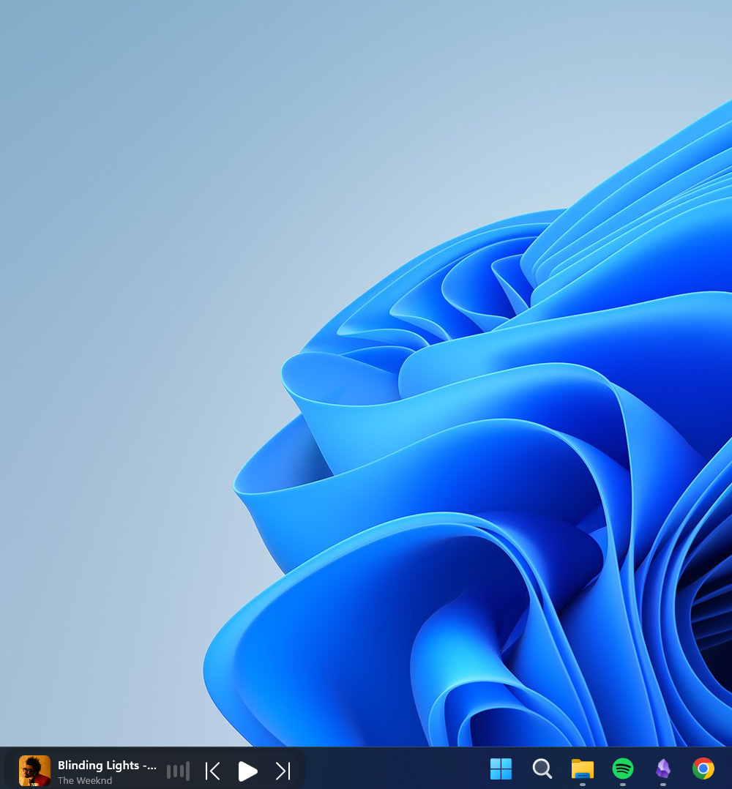
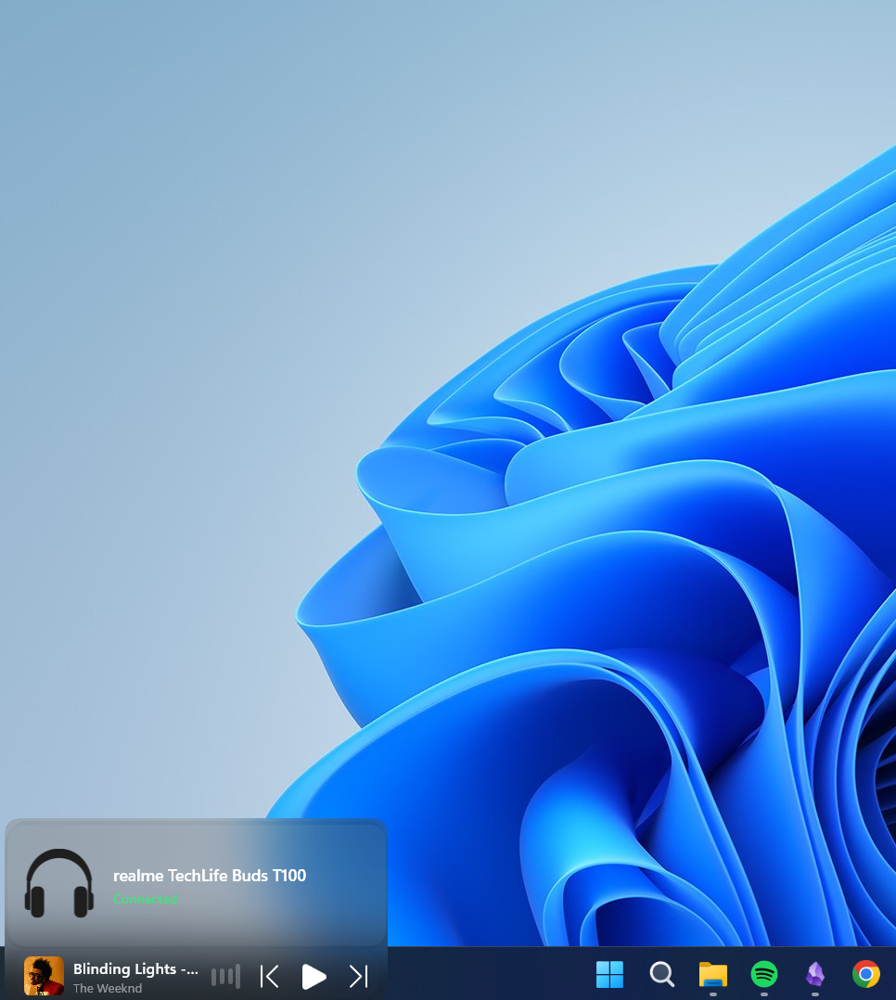
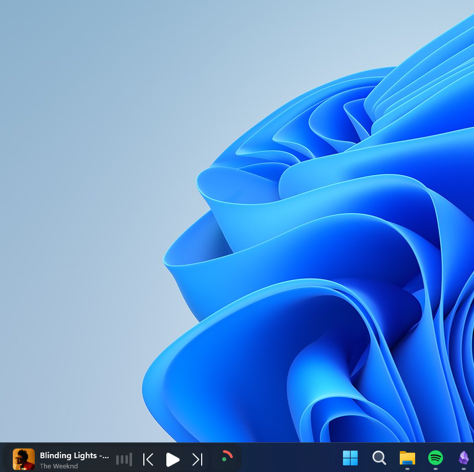
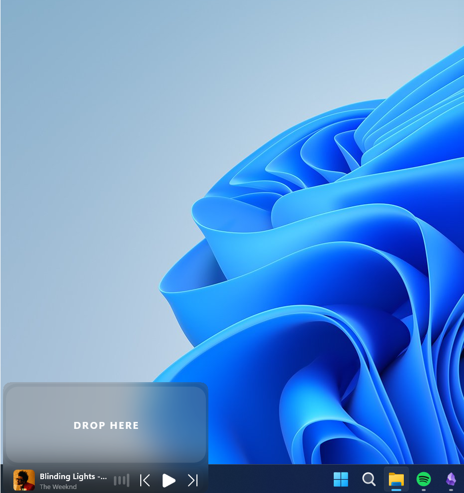
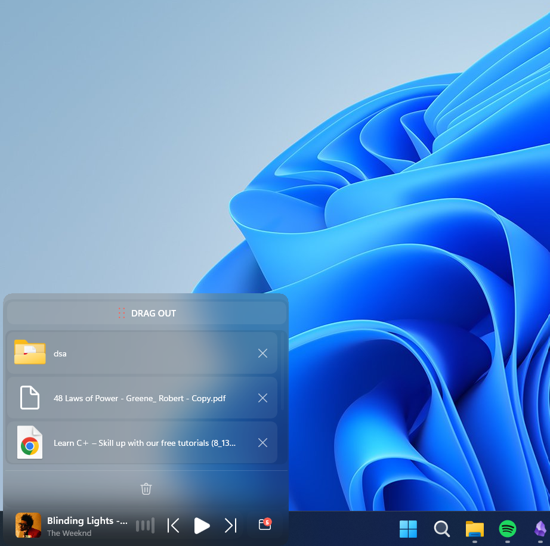

<!-- Improved compatibility of back to top link: See: https://github.com/othneildrew/Best-README-Template/pull/73 -->
<a id="readme-top"></a>


<!-- PROJECT SHIELDS -->
<!--
*** I'm using markdown "reference style" links for readability.
*** Reference links are enclosed in brackets [ ] instead of parentheses ( ).
*** See the bottom of this document for the declaration of the reference variables
*** for contributors-url, forks-url, etc. This is an optional, concise syntax you may use.
*** https://www.markdownguide.org/basic-syntax/#reference-style-links
-->
[![Contributors][contributors-shield]][contributors-url]
[![Forks][forks-shield]][forks-url]
[![Stargazers][stars-shield]][stars-url]
[![Issues][issues-shield]][issues-url]


<!-- PROJECT LOGO -->
<br />
<div align="center">
  <a href="https://github.com/pruthviraj-bev/Halo-Bar">
    
  </a>

  <h3 align="center">Halo Bar</h3>

  <p align="center">
    A macOS-style Dynamic Island / taskbar widget bar, designed for Windows 11 with Fluent Design.
    <br />
    <a href="https://github.com/pruthviraj-bev/Halo-Bar/releases"><strong>Download the installer »</strong></a>
    <br />
    <br />
    <a href="https://github.com/pruthviraj-bev/Halo-Bar/issues/new?labels=bug">Report Bug</a>
    &middot;
    <a href="https://github.com/pruthviraj-bev/Halo-Bar/issues/new?labels=enhancement">Request Feature</a>
  </p>
</div>


<!-- TABLE OF CONTENTS -->
<details>
  <summary>Table of Contents</summary>
  <ol>
    <li>
      <a href="#about-the-project">About The Project</a>
      <ul>
        <li><a href="#showcase">Showcase</a></li>
        <li><a href="#built-with">Built With</a></li>
      </ul>
    </li>
    <li>
      <a href="#getting-started">Getting Started</a>
      <ul>
        <li><a href="#prerequisites">Prerequisites</a></li>
        <li><a href="#installation">Installation</a></li>
      </ul>
    </li>
    <li><a href="#features">Features</a></li>
    <li><a href="#usage">Usage</a></li>
    <li><a href="#roadmap">Roadmap</a></li>
    <li><a href="#contributing">Contributing</a></li>
    <li><a href="#contact">Contact</a></li>
    <li><a href="#acknowledgments">Acknowledgments</a></li>
  </ol>
</details>


<!-- ABOUT THE PROJECT -->
## About The Project

Halo Bar is a **Windows 11 taskbar widget bar** inspired by Apple's Dynamic Island. It lives in your taskbar as a compact capsule that expands — on click — into a rich, Fluent Design dashboard with live system monitoring, weather, clipboard history, media controls, Bluetooth device status, focus sessions and a drag-and-drop file shelf.

It is **not** an Apple clone: the goal is something that feels like it was designed by Microsoft for Windows 11 — native WinUI 3, real acrylic/Mica backdrop, and taskbar-aware behavior.

Key design principles:
- **Taskbar-aware** — auto-shrinks when taskbar apps crowd the island, and lifts the expanded dashboard above the taskbar so it never blocks clicks.
- **Native & light** — built entirely on WinUI 3 / Windows App SDK 1.8, no Electron or web shell.
- **Live & real** — real CPU/RAM/disk/network metrics, real weather, real clipboard history, real media session metadata.

<p align="right">(<a href="#readme-top">back to top</a>)</p>


### Showcase

Watch Halo Bar in action:

<p align="center">
  <video src="showcase/demo-video.mp4" controls width="100%"></video>
</p>

Demo screenshots:

<p align="center">
  
  
  
  
  
  
</p>


### Built With

* [![.NET][.NET]][.NET-url]
* [![C#][C#]][C#-url]
* [![Windows][Windows]][Windows-url]
* [![WinUI 3][WinUI]][WinUI-url]
* [![MVVM Toolkit][MVVM]][MVVM-url]

<p align="right">(<a href="#readme-top">back to top</a>)</p>


<!-- GETTING STARTED -->
## Getting Started

### Prerequisites

* Windows 11
* Visual Studio 2022+ (or .NET CLI) with the Windows App SDK workload
* .NET 10 SDK

### Installation

1. Grab the latest release installer from the [Releases](https://github.com/pruthviraj-bev/Halo-Bar/releases) page — it bundles the app and the Windows App SDK runtime, so it works on clean machines.
2. Or clone and build from source:
   ```sh
   git clone https://github.com/pruthviraj-bev/Halo-Bar.git
   cd Halo-Bar/DynamicIsland
   dotnet build -c Release
   ```

<p align="right">(<a href="#readme-top">back to top</a>)</p>


<!-- FEATURES -->
## Features

* **Dynamic Island shell** — compact taskbar capsule with smooth expand/collapse motion into a 620×640 dashboard
* **Live system monitoring** — real CPU, RAM, disk capacity and network throughput
* **Weather** — real data with a manual city override and Meteocons icons
* **Clipboard history** — searchable, pinnable, with retention auto-delete
* **Media controls** — Now Playing metadata, album art, playback controls and an animated visualizer
* **Bluetooth** — connected-device popups with GATT battery readouts
* **Focus sessions** — Pomodoro timer with round tracking and a completion ring
* **File shelf** — drag-and-drop file stash with thumbnails, launch and delete
* **Taskbar width-awareness** — auto-shrinks/expands based on taskbar crowding (170/250/320 DIPs) with hysteresis
* **Fullscreen suppression** — hides the window entirely in fullscreen mode
* **Acrylic / Mica backdrop** — real Windows composition materials
* **Settings page** — accent color, widget toggles, retention controls and check-for-updates

<p align="right">(<a href="#readme-top">back to top</a>)</p>


<!-- USAGE -->
## Usage

Halo Bar is a widget, not a classic app — it lives on your taskbar and has no desktop shortcut.

* **Hover or click the capsule** to expand the dashboard.
* Click the **gear icon** in the dashboard footer to open Settings (accent color, widget toggles, check-for-updates).
* Click a **clipboard item** to copy it back; use the All/Pinned filter pills and search to find history.
* Drag files onto the **File Shelf** to stash them.
* Use the **Focus card** to start a Pomodoro session.

<p align="right">(<a href="#readme-top">back to top</a>)</p>


<!-- ROADMAP -->
## Roadmap

- [x] Dynamic Island shell + expand/collapse motion
- [x] Live system monitoring (CPU / RAM / disk / network)
- [x] Weather with manual city override
- [x] Clipboard history (search, pin, auto-delete)
- [x] Media controls + visualizer
- [x] Bluetooth device popups
- [x] Focus sessions / Pomodoro
- [x] File shelf (drag-and-drop)
- [x] Settings page
- [x] V1 installer (Inno Setup + bundled runtime)
- [ ] Code signing for the installer
- [ ] Automated release build (GitHub Actions)
- [ ] Mica backdrop option in Settings

See the [open issues](https://github.com/pruthviraj-bev/Halo-Bar/issues) for a full list of proposed features (and known issues).

<p align="right">(<a href="#readme-top">back to top</a>)</p>


<!-- CONTRIBUTING -->
## Contributing

Contributions are what make the open source community such an amazing place to learn, inspire, and create. Any contributions you make are **greatly appreciated**.

If you have a suggestion that would make this better, please fork the repo and create a pull request. You can also simply open an issue with the tag "enhancement".

1. Fork the Project
2. Create your Feature Branch (`git checkout -b feature/AmazingFeature`)
3. Commit your Changes (`git commit -m 'Add some AmazingFeature'`)
4. Push to the Branch (`git push origin feature/AmazingFeature`)
5. Open a Pull Request

<p align="right">(<a href="#readme-top">back to top</a>)</p>


<!-- CONTACT -->
## Contact

Pruthviraj B. - [GitHub](https://github.com/pruthviraj-bev)

Project Link: [https://github.com/pruthviraj-bev/Halo-Bar](https://github.com/pruthviraj-bev/Halo-Bar)

<p align="right">(<a href="#readme-top">back to top</a>)</p>


<!-- ACKNOWLEDGMENTS -->
## Acknowledgments

* [othneildrew/Best-README-Template](https://github.com/othneildrew/Best-README-Template)
* [Meteocons weather icons (MIT) — Bas Milius](https://bas.dev/work/meteocons)
* [Open-Meteo API](https://open-meteo.com/)
* [CommunityToolkit.Mvvm](https://learn.microsoft.com/en-us/dotnet/communitytoolkit/mvvm/)
* [Windows App SDK](https://learn.microsoft.com/en-us/windows/apps/windows-app-sdk/)

<p align="right">(<a href="#readme-top">back to top</a>)</p>


<!-- MARKDOWN LINKS & IMAGES -->
<!-- https://www.markdownguide.org/basic-syntax/#reference-style-links -->
[contributors-shield]: https://img.shields.io/github/contributors/pruthviraj-bev/Halo-Bar.svg?style=for-the-badge
[contributors-url]: https://github.com/pruthviraj-bev/Halo-Bar/graphs/contributors
[forks-shield]: https://img.shields.io/github/forks/pruthviraj-bev/Halo-Bar.svg?style=for-the-badge
[forks-url]: https://github.com/pruthviraj-bev/Halo-Bar/network/members
[stars-shield]: https://img.shields.io/github/stars/pruthviraj-bev/Halo-Bar.svg?style=for-the-badge
[stars-url]: https://github.com/pruthviraj-bev/Halo-Bar/stargazers
[issues-shield]: https://img.shields.io/github/issues/pruthviraj-bev/Halo-Bar.svg?style=for-the-badge
[issues-url]: https://github.com/pruthviraj-bev/Halo-Bar/issues
[.NET]: https://img.shields.io/badge/.NET-512BD4?style=for-the-badge&logo=dotnet&logoColor=white
[.NET-url]: https://dotnet.microsoft.com/
[C#]: https://img.shields.io/badge/C%23-239120?style=for-the-badge&logo=csharp&logoColor=white
[C#-url]: https://learn.microsoft.com/en-us/dotnet/csharp/
[Windows]: https://img.shields.io/badge/Windows-0078D6?style=for-the-badge&logo=windows&logoColor=white
[Windows-url]: https://www.microsoft.com/windows/windows-11
[WinUI]: https://img.shields.io/badge/WinUI%203-0C7DB5?style=for-the-badge&logo=windows&logoColor=white
[WinUI-url]: https://learn.microsoft.com/en-us/windows/apps/winui/winui3/
[MVVM]: https://img.shields.io/badge/MVVM%20Toolkit-512BD4?style=for-the-badge&logo=dotnet&logoColor=white
[MVVM-url]: https://learn.microsoft.com/en-us/dotnet/communitytoolkit/mvvm/